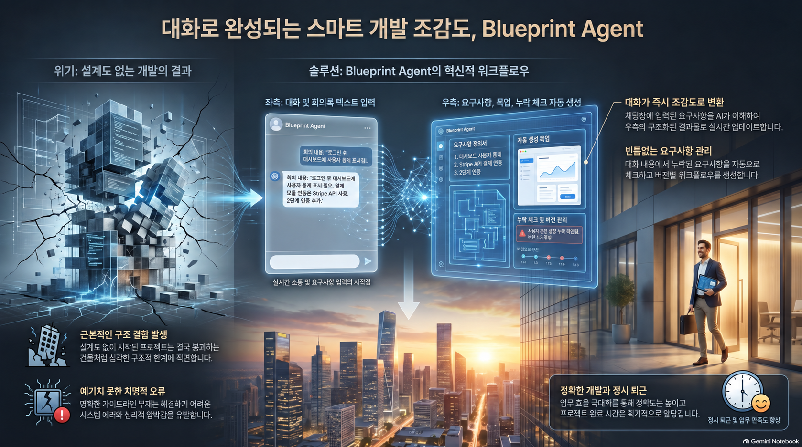
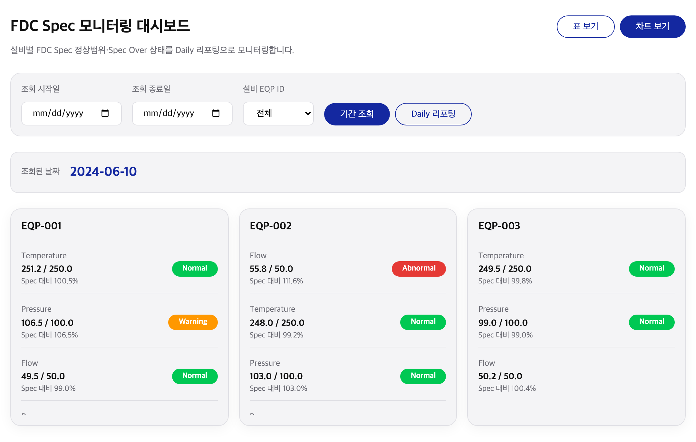
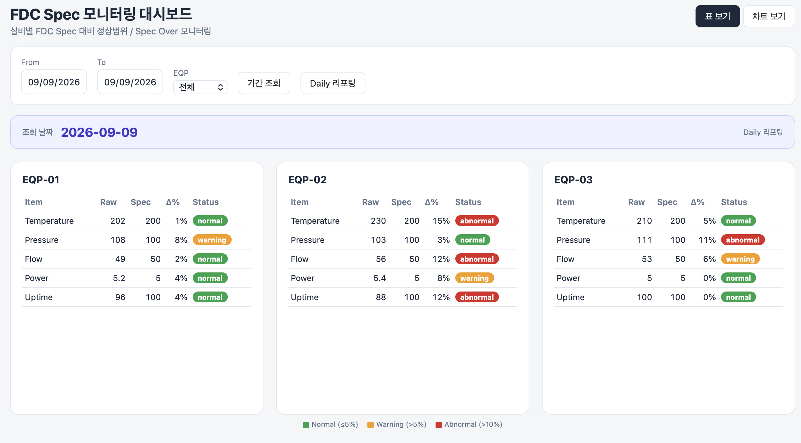
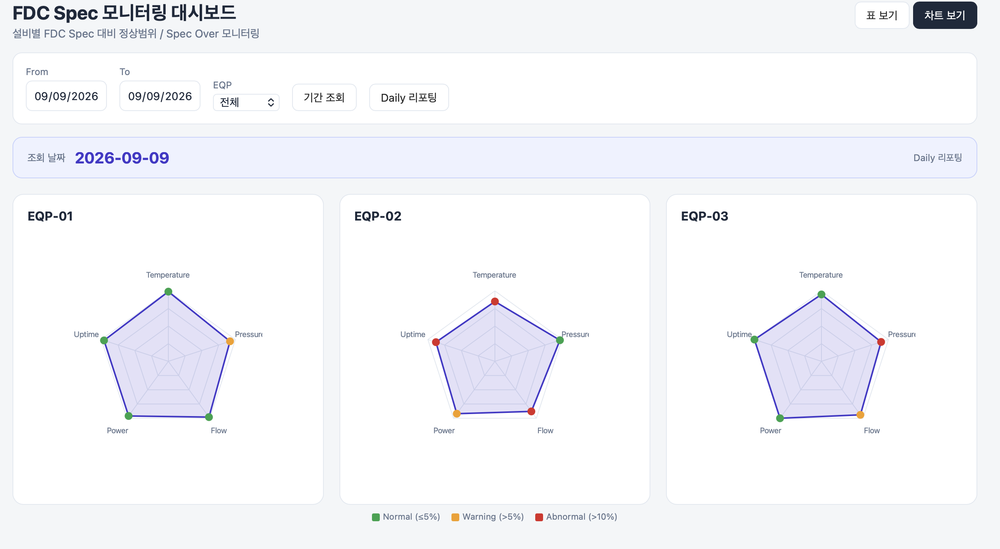

<div align="center">

# 🧭 Blueprint Agent

### 회의 대화를 → 눈으로 확인하는 목업 + 하류가 소비하는 요구·제약·시각 계약으로

**AI-DLC의 앞단(requirements·constraints 작성)을 고도화하는 에이전트.**<br>
오해는 회의에서 생긴다 — 그 자리에서 바로 볼 수 있는 목업으로 오해를 소진한다.

<p>
  
  
  
  
  
</p>

<p>
  <b>
  <a href="#골든패스-이-제품의-핵심-흐름">골든패스</a> ·
  <a href="#한-눈에-보는-아키텍처">아키텍처</a> ·
  <a href="#시작하기">시작하기</a> ·
  <a href="#사용-매뉴얼">사용법</a>
  </b>
</p>

https://github.com/user-attachments/assets/9e16fe6e-cdd3-42d7-be4b-d69e5d98354a



</div>

---

AI-DLC는 구조화된 요구·제약을 하류로 내려보내 개발을 진행한다. 그런데 "회의에서 오간 말"을 "AI-DLC가 소비할 수 있는 요구·제약"으로 정리하는 **그 앞단**은 비어 있다. Blueprint Agent가 그 빈 곳을 채운다.

핵심은 **피드백 루프를 회의 자리로 당기는 것**이다. 오해는 회의에서 이미 생기는데, 보통은 MVP가 나온 뒤에야 드러난다 — 그때는 이미 토큰·시간을 쓴 뒤다. 이 제품은 회의 자리에서 **바로 볼 수 있는 목업**을 만들어 오해를 그 자리에서 소진한다.

## 골든패스 (이 제품의 핵심 흐름)

```
회의 대화 입력  →  requirements·constraints 추출  →  목업(HTML) publish  →  누락 체크(채택/제외)
                                                                                    │
                      버전 선택 → Export(=확정)  ◀────── 피드백 이터레이션(대화로 고도화·republish)
```

- **원천은 requirements·constraints이고, 목업은 그로부터 나온 파생 뷰다.** 피드백은 목업을 직접 편집하는 게 아니라 대화·요청으로 들어와 요구·제약을 고치고, 목업은 거기서 다시 렌더된다.
- export 시점에 목업에서 **시각 계약(Visual Contract)** 을 결정적으로 추출한다(모델 미사용).

## 한 눈에 보는 아키텍처

**개념 구조 — 프로젝트 > 회의체 > 버전**

```
프로젝트 (영속)
 └─ 회의체 (하나의 토론 단위; 여러 번 이터레이션)
     └─ 버전 (피드백 루프마다 생성; 임의 버전을 골라 Export=확정)
```

**모듈 맵**

```
Blueprint-Agent/
  src/
    server/    Fastify(:3000) — HTTP API + 세션 스코프 SSE(/events?sid=) + 잡 러너
    shared/    types · store(계층형: 인덱스=node:sqlite, 산출물=파일) · llm 클라이언트 · id 생성
    stages/    extract → mockup → coverage → contract(결정적) → export → reimport
    prompts/   extract·mockup·coverage 시스템 프롬프트
  dashboard/   React + TS + Tailwind — 단일 통합 콘솔(모드 분리 없음)
  fixtures/    seed-transcripts/ 예시 회의 녹취 · fixture.html 초기 프리뷰 화면
  data/        (런타임) projects/…/versions/… · exports/…/v<n>/
  aidlc-docs/  이 제품 자체를 AI-DLC로 만든 산출물(정본은 requirements/)
```

- **모델 쓰는 단계**(extract·mockup·coverage)는 비동기 — `POST → 202(jobId) → GET /jobs/:id` 폴링 + SSE 스트리밍.
- **결정적 단계**(시각 계약 추출·export·import)는 동기로 즉시 응답. 계약 추출은 Playwright로 목업의 기하·구조만 읽는다 — **같은 목업이면 언제나 같은 계약**(모델 비용 0).

**export 세트** (Export한 버전마다 `data/exports/<project>/<meeting>/v<n>/`)

| 파일 | 내용 |
|---|---|
| `requirements.md` / `constraints.md` | 확정본 (항목별 `[근거: u-NNN]`) |
| `mockup.html` | 확정 목업 |
| `visual-contract.json` | 목업에서 결정적 추출한 시각 계약 (기계 판독) |
| `visual-contract.yaml` | 위와 동일 내용의 시각 계약 (사람 판독 편의) |
| `trace.json` | 근거 추적 정본(발언·항목·결정·계보) |
| `manifest.json` | re-import 왕복의 최소 정보(중요 의결사항 + 근거) |

## 시작하기

### 사전 요건

- **Node.js 22 이상** — 저장 계층이 `node:sqlite`(Node 22+ 내장)를 쓴다. 그 아래 버전은 서버가 뜨지 않는다.
- LLM 접근용 API 자격 — 키 없이도 설치·빌드는 되지만, extract·mockup·coverage(모델 단계)는 키가 있어야 동작한다.

### 설치

```bash
npm install          # postinstall이 시각 계약 추출용 Playwright Chromium도 내려받는다
```

### 환경변수 (`.env.example` 참고)

`src/shared/llm.ts`가 아래 두 프로바이더 중 설정된 쪽을 자동 선택한다. **키는 코드에 하드코딩하지 않는다(env 전용).**

```bash
# Provider A — Amazon Bedrock (데모 기본값)
AWS_BEARER_TOKEN_BEDROCK=your-bearer-token
AWS_REGION=ap-northeast-2
LLM_MODEL=global.anthropic.claude-opus-4-8

# Provider B — Anthropic Messages API (대안; 위 Bedrock 대신 설정)
# ANTHROPIC_API_KEY=your-key
# ANTHROPIC_BASE_URL=https://api.anthropic.com
# LLM_MODEL=claude-opus-4-8

PORT=3000
```

### 실행

**개발(터미널 2개, 핫리로드):**

```bash
npm run dev:server      # 백엔드 → http://localhost:3000
npm run dev:dashboard   # 대시보드 → http://localhost:5173  (API·SSE는 :3000으로 프록시)
```

접속: **http://localhost:5173**

**프로덕션/단일 포트(빌드 후):**

```bash
npm run build:dashboard   # dashboard/dist 생성
npm start                 # :3000 하나에서 API + 빌드된 대시보드를 함께 서빙
```

접속: **http://localhost:3000**

## 사용 매뉴얼

단일 콘솔에서 골든패스를 그대로 돈다. 좌측은 회의 대화(채팅), 우측은 산출물(요구·제약 문서 / 목업 프리뷰)이다.

1. **대화 입력** — 좌측 패널에 회의 녹취를 붙여넣는다. `발언자: 내용` 형식을 쓰면 발언자별로 구분되고, 라벨 없는 줄도 하나의 발언으로 들어간다. 예시는 `fixtures/seed-transcripts/`의 3개 도메인 녹취(태스크 상세 · 주문 상세 · 진료 예약)를 그대로 붙여 쓰면 된다. 발언자는 실명(이종덕·변규백·박유도·박민구·박수만)으로 되어 있어 실제 회의처럼 읽힌다.
2. **생성** — requirements·constraints를 추출하고(`extract`) 목업을 publish한다(`mockup`). 생성 중에는 상단에 진행 상태가 실시간 표시되고 실행 버튼이 비활성화된다. **생성 중 새로고침해도 진행 상태가 그대로 복원된다**(작업 상태는 서버에 회의체 단위로 영속). 완료되면 우측에 요구·제약 문서와 목업 프리뷰가 뜬다. 각 항목에는 `[근거: u-NNN]` 태그가 붙어 어느 발언에서 나왔는지 역추적된다. 채팅·근거 태그에서 발언자 실명이 크게, `u-NNN`이 작게 병기된다.
3. **누락 체크(coverage)** — 대화 전체 대비 현재 요구·제약을 대조해 "요청됐으나 반영 안 된 항목"을 체크리스트로 flag한다. 각 항목을 사람이 **채택**(요구/제약으로 편입) 또는 **의도적 제외**(제외 결정 자체가 하나의 constraint가 됨) 중 하나로 처리한다. 자동 추가는 하지 않는다 — 요청은 반영처 없이 사라지지 않는다.
4. **피드백 이터레이션** — 목업을 본 사람들의 피드백을 다시 대화로 추가하면, 근거 델타 기반으로 요구·제약을 고도화(develop)하고 목업을 republish한다. 만족할 때까지 반복. 버전 칩을 선택하면 그 버전의 requirements·constraints·목업이 함께 전환된다.
5. **버전 선택 → Export(=확정)** — 만족한 버전을 버전 목록에서 골라 **Export**하면 그 버전이 확정본으로 산출된다(별도 freeze 단계 없음). 확정본 + 목업 + 시각 계약(JSON·YAML) + 근거 추적 메타를 파일 세트로 낸다. 이 세트는 다른 회의체에서 **re-import**(왕복)하거나, 하류 개발 사이클(SRS·HLD·LLD·ADR·코드)의 입력으로 태울 수 있다.
6. **버전 정리** — 원치 않게 생긴 버전은 버전 목록에서 **우클릭 → 삭제**한다. 해당 버전에 export 이력이 있으면 경고가 뜨고, **"그래도 삭제"** 재확인한 경우에만 삭제된다.

### 스크린샷

실행 화면 캡처는 `screenshots/`에 있다. 없으면 위 URL로 직접 확인한다.

### 트러블슈팅

| 증상 | 원인 · 해결 |
|---|---|
| 서버가 `node:sqlite` 관련 오류로 안 뜸 | Node 22 미만이다. `node -v` 확인 후 22+로 올린다. |
| 모델 단계에서 `"LLM 환경 미설정"` | `.env`에 Bedrock 또는 Anthropic 자격을 설정. 키 없이 UI는 뜨지만 extract/mockup/coverage는 실행 불가. |
| 대시보드는 뜨는데 데이터가 안 옴 | `dev:server`가 :3000에 떠 있는지 확인. dev 대시보드(:5173)는 :3000으로 프록시한다. |
| export의 시각 계약 추출이 실패 | Playwright Chromium이 필요하다. `npx playwright install chromium` 재실행. |
| LAN(http)에서 접속 시 크래시 | `crypto.randomUUID`는 보안 컨텍스트(HTTPS/localhost) 전용 — 폴백 처리됨. 최신 코드로 갱신. |
| 비동기 잡이 안 끝남 | 폴링 타임아웃 480초. LLM 지연이면 대기, 반복되면 서버 로그 확인. |

## 시스템 불변 원칙 6가지

전 기능에 우선한다. 어떤 기능도 이를 위반하지 않는다. (상세 제약 `requirements/constraints.md` C-1~C-6과 대응)

| # | 원칙 | ↔ |
|---|---|---|
| 1 | 원천은 requirements·constraints, 목업은 파생물. 하류로 나가는 것은 목업 원본이 아니라 시각 계약. | C-2 |
| 2 | 근거 없는 생성 금지. 대화에 없는 요구·제약, 요구·제약에 없는 목업 요소를 만들지 않는다. | C-3 |
| 3 | 근거 없는 변경·삭제 금지. 고도화는 근거(대화·피드백) 없이 발생하지 않는다. | C-4 |
| 4 | 근거 없는 휘발 금지. 등장한 요청은 채택되거나 명시적으로 제외되며, 반영처 없이 사라지지 않는다. | C-5 |
| 5 | 계약 추출의 결정성. export 시점 시각 계약 추출은 모델을 쓰지 않는다. 동일 입력 → 동일 계약, 비용 0. | C-1 |
| 6 | 근거 보존. 모든 산출물은 상위 산출물과 그 근거(회의 발언)를 함께 보존한다. | — |

### 제약 요약 (C-1~C-6)

- **C-1** export 계약 추출에 언어 모델을 도입하지 않는다(결정적·렌더 기반).
- **C-2** 원천은 requirements·constraints, 목업은 파생물 — 목업 손편집으로 원천을 우회 수정하지 않는다.
- **C-3** 근거 없는 보완 생성을 허용하지 않는다 — 부족한 것은 부족한 채로 둔다.
- **C-4** 고도화(수정)는 직전 버전 + 근거 델타로만 — 델타 0이면 수정 차단.
- **C-5** 대화에 등장한 요청은 채택 또는 명시적 제외로만 귀결 — 휘발 금지.
- **C-6** 얇은 슬라이스 — 음성 입력 등 부수 기능이 core 골든패스를 복잡화하지 않는다.

## 실사용 사례 — FDC Spec 모니터링 대시보드

Blueprint Agent의 export가 하류를 실제로 태울 수 있음을 보인 end-to-end 사례. 회의 녹취부터 배포된 MVP까지 사람이 코드를 처음부터 쓰지 않았다.

```
회의 대화(FDC 모니터링 논의)
  → Blueprint Agent: requirements·constraints 추출 + 목업 5회 이터레이션(v1→v4)
  → Export: requirements.md · constraints.md · visual-contract.yaml · trace.json · manifest.json
  → AI-DLC v1.0.1: 인셉션(요구/제약 정제·워크플로우·설계·유닛) → 컨스트럭션(코드 생성)
  → 산출물: 무빌드·무의존 대시보드 MVP (5축 SVG 레이더 · 표↔차트 전체 전환 · Daily/기간 조회)
```

- **export가 그대로 AI-DLC 입력이 됐다.** `visual-contract.yaml`은 컴포넌트/액션/바인딩의 단일 기준으로, `trace.json`의 `u-NNN` 근거는 요구 항목 추적으로 하류까지 이어졌다.
- **오해가 회의에서 소진된 흔적**이 export에 남아 있다 — 목업 v1의 "조회 날짜 시각화 부족", v2의 "비율이 안 보임 → rawdata+판정 병기", "숫자 대신 레이더 차트", "축별 상태색", "표/차트 전체 일괄 전환" 요구가 전부 `[근거: u-006·u-012·u-013·u-014·u-019]`로 확정본에 반영됐다.
- 결과 레포: **[sinsa902/fdc_dashboard](https://github.com/sinsa902/fdc_dashboard)** — Blueprint Agent export(`require/`) + AI-DLC 산출물(`aidlc-docs/`) + 실행 가능한 MVP(`index.html`)가 한 레포에 함께 보존됐다.

**export 목업 ↔ AI-DLC 산출물 (스크린샷 대조)**

<table>
<tr>
  <th width="34%">① export 목업 (v4 <code>mockup.html</code>)</th>
  <th width="33%">② AI-DLC 산출물 — 표 보기</th>
  <th width="33%">② AI-DLC 산출물 — 차트 보기</th>
</tr>
<tr>
  <td></td>
  <td></td>
  <td></td>
</tr>
<tr>
  <td>회의 이터레이션으로 확정된 목업. 여기서 <code>visual-contract.yaml</code>이 결정적으로 추출돼 하류로 나간다.</td>
  <td>목업의 Spec 대비 비율·판정을 Raw·Spec·<b>Δ%</b>·Status 표로 구현.</td>
  <td>목업 카드가 남긴 차트 요구(placeholder)를 5축 레이더·축별 상태색으로 실구현.</td>
</tr>
</table>

목업(`visual-contract.yaml`)의 요구가 그대로 구현됐다 — 5축(temperature·pressure·flow·power·uptime) 레이더, 축별 정상/warning/abnormal 상태색, Spec 대비 Δ% 판정(≤5% normal · &gt;5% warning · &gt;10% abnormal), 조회 날짜 배너.

**export 목업(시각 계약) ↔ AI-DLC 산출물 대조**

계약이 하류에서 얼마나 충실히 소비됐는지 항목별로 검증한 표. "목업" 열은 export의 `visual-contract.yaml`(컴포넌트 `c-*`·액션 `a-*`·바인딩), "AI-DLC 산출물" 열은 결과 레포의 `index.html` 구현이다.

| 요소 | 목업 (export 시각 계약) | AI-DLC 산출물 (구현) | 판정 |
|---|---|---|---|
| 제목/부제 | `c-title`, `c-subtitle` | `<h1>` + subtitle | ✅ 일치 |
| 뷰 전환 | `a-view-table`/`a-view-chart` → `bind fdcSpec.viewMode` | 우상단 버튼, **전체 카드 일괄 전환** | ✅ 일치 |
| 조회 툴바 | `c-input-from/to`, `c-select-eqp`, `a-query-range`, `a-daily-report` | From/To/EQP + 기간 조회 · Daily 리포팅 | ✅ 일치 |
| 조회 날짜 배너 | `c-date-banner` → `bind report.queriedDate` | 날짜 배너 + 모드 표기 | ✅ 일치 |
| 설비 카드 | `c-spec-cards`(list), `c-card-*` 339×339 정사각 | `aspect-ratio:1/1` 카드 그리드 | ✅ 일치 |
| 카드 표 뷰 | rawdata + 판정 + 비율 (요구 항목) | Raw·Spec·**Δ%**·Status 표 | 🔎 구체화(컬럼 확정) |
| 카드 차트 뷰 | `c-chart-*` role:`image`, box 0×0 **(placeholder)** → `bind fdcSpec.specRatio` | **5축 SVG 레이더**, score 반경, 축별 상태색 | 🔧 placeholder→실구현 |
| 축 5종 | temperature·pressure·flow·power·uptime (영어) | 동일 5축, 영어 라벨 | ✅ 일치 |
| 판정 기준 | Spec 대비 &gt;5% warning / &gt;10% abnormal | `computeAxis`: ≤5 normal·≤10 warning·그외 abnormal | ✅ 일치 |
| Spec 기준값 | **미정** (목업에 절대값 없음) | 인셉션에서 mock 확정(`data/mock.js`) | ➕ 인셉션 결정 |
| 기간 시계열 조회 | `a-query-range` result:`list` | mock 단일 스냅샷 → EQP 필터+배너까지 | ⚠️ MVP 범위 축소 |

- ✅ **일치**: 계약이 손실 없이 하류로 전달됨. 뷰 전환의 "전체 일괄"(C-1 성격), 5축·판정 기준까지 계약 그대로.
- 🔧🔎 **구체화/실구현**: 목업이 남긴 여백(차트 placeholder, 표 컬럼)을 하류가 계약 위반 없이 채움.
- ➕⚠️ **하류 결정**: 목업에 없던 값(Spec 기준·mock 데이터)과 MVP 스코프(시계열 축소)는 AI-DLC 인셉션에서 근거를 남기고 확정 — Blueprint Agent의 "근거 없는 생성 금지"가 하류 경계에서도 지켜진 지점.

> 이 사례가 "범위 밖(하류 몫)"을 실증한다 — Blueprint Agent는 확정본·목업·계약까지 책임지고, 그 입력만으로 하류(AI-DLC)가 코드를 만들어냈다.

## 범위

**범위 안** — 대화 입력·저장 · req·constraints 추출 · 목업 publish · 이터레이션·고도화 · 누락 체크 · 버전 선택·삭제 · Export(=확정) & 결정적 계약 추출 · re-import · 근거 추적성 · 단일 콘솔.

**범위 밖(하류 몫)** — SRS·ERD·OpenAPI·HLD·LLD·ADR 산출, 코드 생성. 전부 export를 소비하는 하류 개발 사이클의 몫이다. 이 제품은 그 입력(확정본·목업·계약)까지만 책임진다.

> 요구의 유일 정본(SSOT)은 `requirements/blueprint-agent-requirements.md` + `requirements/constraints.md`이고, 디자인 규격 정본은 `requirements/samsung-design-guidelines.md`다.
